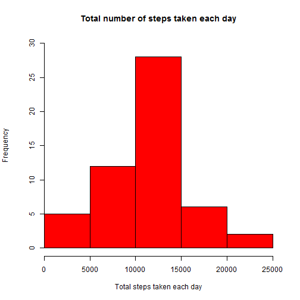

This R Markdown document is the report created for assignment Peer Assessment-1, Reproducible Research. 
The flow of the document follows the sequence in a way questions are asked in the assignment.

### Loading and preprocessing the data:

The data can loaded using functon read.csv(). The data is stored in the variable name "data". We can see
different aspect of the data using the functions like head(), tail(), names(), etc


```r
data <- read.csv("activity.csv")
head(data)
```

```
##   steps       date interval
## 1    NA 2012-10-01        0
## 2    NA 2012-10-01        5
## 3    NA 2012-10-01       10
## 4    NA 2012-10-01       15
## 5    NA 2012-10-01       20
## 6    NA 2012-10-01       25
```

```r
names(data)
```

```
## [1] "steps"    "date"     "interval"
```
    
### What is mean total number of steps taken per day?
For this part of the assignment it is mentioned that we can ignore the missing values in the dataset.

**1. Calculate the total number of steps taken per day**  
We can calculate total number of steps taken per day using aggregate() function taking sum over the steps
for each of the date.


```r
StepsDay <- aggregate(steps ~ date, data, sum, na.rm=TRUE)
head(StepsDay)
```

```
##         date steps
## 1 2012-10-02   126
## 2 2012-10-03 11352
## 3 2012-10-04 12116
## 4 2012-10-05 13294
## 5 2012-10-06 15420
## 6 2012-10-07 11015
```

**2. Make a histogram of the total number of steps taken each day**  
We can create the histogram of the total number of steps taken each day in the folloing way
. 

```r
hist(StepsDay$steps, axes=FALSE, main="Total number of steps taken each day",
     xlab="Total steps taken each day", col = "red", ylim = c(0,30))

axis(1, seq(0, 25000, by=5000))
axis(2, pos=1)
```

 
  
**3. Calculate and report the mean and median of the total number of steps taken per day**  

Mean and median of the total number of steps taken per day can be calculated using functions mean() and median().


```r
Stepmean <- mean(StepsDay$steps, na.rm=TRUE)
Stepmean
```

```
## [1] 10766.19
```

```r
Stepmedian <- median(StepsDay$steps, na.rm=TRUE)
Stepmedian
```

```
## [1] 10765
```

The calculated value of **mean** is **10766.19** and **median** is **10765**

    
### What is the average daily activity pattern?
**1. Make a time series plot (i.e. type = "l") of the 5-minute interval (x-axis) and the average number of steps taken, averaged across all days (y-axis)**  

Below is the time series plot of average number of steps taken with respect to time interval.


```r
FiveMinIntData <- aggregate(steps ~ interval, data, mean, na.rm=TRUE)

plot(FiveMinIntData$interval, FiveMinIntData$steps, type = "l", col="red",
     xlab = "Time Interval", ylab = "Number of steps", 
     main = "Average number of steps across all days with time interval")
```

 

**2. Which 5-minute interval, on average across all the days in the dataset, contains the maximum number of steps?**  

This can be determined using which.max() function


```r
index1 <- which.max(FiveMinIntData$steps)
FiveMinIntData[index1, ]
```

```
##     interval    steps
## 104      835 206.1698
```

835th interval has maximum number of steps with value of 206.16  

### Imputing missing values  

**1. Calculate and report the total number of missing values in the dataset (i.e. the total number of rows with NAs)**     

The total number of missing values can be calculated using sum(is.na())


```r
NAcount <- sum(is.na(data$steps))
NAcount
```

```
## [1] 2304
```

The total number of missing values found in data are 2304  

**2. Devise a strategy for filling in all of the missing values in the dataset. The strategy does not need to be sophisticated. For example, you could use the mean/median for that day, or the mean for that 5-minute interval, etc.**
 
There are different ways to deal with missing data. Missing values can be replaced with mean, median or mode of the dataset. Also there are various data imputations strategies developed based on statistical methods.  

In this example mean and median are very close. Here we will replace NA values in the dataset with mean steps for that perticular interval.  

**3. Create a new dataset that is equal to the original dataset but with the missing data filled in.**

New dataset is created below via filling missing data in the original dataset. Filled NA values are mean steps for that interval. We can see using **head(newdata)** that NA values are replaced with mean steps value.


```r
newdata <- data

tempvec <- FiveMinIntData$interval

ncoldata <- dim(data)[1]

for(i in 1:ncoldata) {
    
    if (is.na(newdata[i, 1])==TRUE) {
        
        tempnum <- newdata[i, 3]
        tempindex <- which(tempvec==tempnum)
        tempx1 <- FiveMinIntData[tempindex, 2]
        newdata[i, 1] <- tempx1
    }    
}

head(newdata)
```

```
##       steps       date interval
## 1 1.7169811 2012-10-01        0
## 2 0.3396226 2012-10-01        5
## 3 0.1320755 2012-10-01       10
## 4 0.1509434 2012-10-01       15
## 5 0.0754717 2012-10-01       20
## 6 2.0943396 2012-10-01       25
```

Also if we calculate sum of NA values in newdata, we will get zero sum. This ensures all the NA values are replaced with mean steps values.


```r
NewNAcount <- sum(is.na(newdata$steps))
NewNAcount
```

```
## [1] 0
```

**4. Make a histogram of the total number of steps taken each day and Calculate and report the mean and median total number of steps taken per day. Do these values differ from the estimates from the first part of the assignment? What is the impact of imputing missing data on the estimates of the total daily number of steps?**

**4.1 Histogram of total steps taken each day**

Below is the histogram of total steps taken each day.


```r
NewStepsDay <- aggregate(steps ~ date, newdata, sum)

hist(NewStepsDay$steps, axes=FALSE, main="Total number of steps taken each day after imputing NAs", 
     xlab="Total steps taken each day", col = "red")

axis(1, seq(0, 25000, by=5000))
axis(2, pos=1)
```

 

**4.2 Report the mean and median total number of steps taken per day. Do these values differ from the estimates from the first part of the assignment?**

Mean and median of total number of steps taken per day is calculated as below.  


```r
NewStepmean <- mean(NewStepsDay$steps)
NewStepmean
```

```
## [1] 10766.19
```

```r
NewStepmedian <- median(NewStepsDay$steps)
NewStepmedian
```

```
## [1] 10766.19
```

After replacing NA values in the dataset the new mean is 10766.19 and new median is 10766.19    

Yes these values are slightly differ from previously calculted mean and median values.    

Cosidering NAs in the dataset **mean** is **10766.19** and **median** is **10765**    

After replacing NAs in the dataset with mean step values, **mean** is **10766.19** and **median** is **10766.19**  

**4.3 What is the impact of imputing missing data on the estimates of the total daily number of steps?**  
After replacing the NAs in original data set, we can see that mean is same for original dataset and new dataset but median is slightly shifted in new dataset.  

Also mean and median is same for new dataset.  

If we compare the histograms for original datset and new dataset, we see that peak value is been incresed in new dataset.

### Are there differences in activity patterns between weekdays and weekends?  

**1. Create a new factor variable in the dataset with two levels - "weekday" and "weekend" indicating whether a given date is a weekday or weekend day.**  

Here first of all a new column "day" is intorduced in the new dataset that specifies day of the week corresponds to the date and another column "daylevel" is introduced that specifies whether a day is weekday or weekend. 


```r
day <- weekdays(as.Date(newdata$date))

Daynewdata <- cbind(newdata, day)

daylevel <- c()

for (i in 1:length(day)) {
    if (day[i] == "Saturday") {
        daylevel[i] <- "Weekend"
    } else if (day[i] == "Sunday") {
        daylevel[i] <- "Weekend"
    } else {
        daylevel[i] <- "Weekday"
    }
}

Daylevelnewdata <- cbind(Daynewdata, daylevel)
head(Daylevelnewdata)
```

```
##       steps       date interval    day daylevel
## 1 1.7169811 2012-10-01        0 Monday  Weekday
## 2 0.3396226 2012-10-01        5 Monday  Weekday
## 3 0.1320755 2012-10-01       10 Monday  Weekday
## 4 0.1509434 2012-10-01       15 Monday  Weekday
## 5 0.0754717 2012-10-01       20 Monday  Weekday
## 6 2.0943396 2012-10-01       25 Monday  Weekday
```

**2. Make a panel plot containing a time series plot (i.e. type = "l") of the 5-minute interval (x-axis) and the average number of steps taken, averaged across all weekday days or weekend days (y-axis).**

Below is the time series plot of number of steps with respect to time interval averaged across all weekday days or weekend days.


```r
FiveMinnewdata <- aggregate(steps ~ interval + daylevel, Daylevelnewdata, mean)
#head(FiveMinnewdata)

library(ggplot2)

ggplot(FiveMinnewdata, aes(x=interval, y=steps)) + geom_line(color="red") + 
    facet_wrap(~ daylevel, nrow=2, ncol=1) +
    labs(x="Time Interval", y="Number of steps") +
    theme_bw()
```

 

Yes there are differeces in the activity patterns for the weekdays & weekends. From the plots we can see that for weekdays there is single high peak that depicts highest steps in that perticular time interval and other peaks has comparatively low values.  

However for the weekdyas we see that magnitue of peak is reduced and allmost all the peaks in the plot have comparable values with respect to each other; roughly seems to have somewhat uniformity in the number of steps.
